# RTG Templates - Comprehensive Technical Documentation

## Table of Contents

1. [Executive Summary](#executive-summary)
2. [Software Architect Perspective](#software-architect-perspective)
3. [Software Developer Perspective](#software-developer-perspective)
4. [Product Manager Perspective](#product-manager-perspective)
5. [How to Add a New Template](#how-to-add-a-new-template)
6. [Technical Architecture](#technical-architecture)
7. [Security Considerations](#security-considerations)
8. [Performance Analysis](#performance-analysis)
9. [Future Roadmap](#future-roadmap)

---

## Executive Summary

RTG Templates is a sophisticated CLI tool designed for rapid project scaffolding with pre-configured templates. Built with TypeScript and Node.js, it provides developers with a streamlined way to bootstrap projects with their preferred technology stacks. The tool supports interactive and command-line modes, template customization, and post-installation automation.

### Key Metrics

- **Codebase Size**: ~2,000 lines of TypeScript
- **Templates Available**: 7 built-in templates
- **Supported Frameworks**: React, Next.js, Node.js, NestJS, FastAPI
- **Add-on Options**: TypeScript, Tailwind CSS, Authentication, Databases
- **Target Node Version**: 16.0.0+

---

## Software Architect Perspective

### 1. Overall Architecture

The RTG Templates system follows a modular, event-driven architecture with clear separation of concerns:

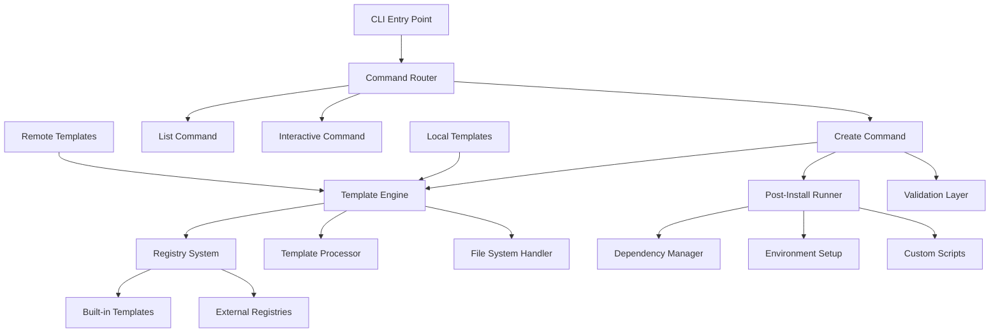

### 2. Core Components Architecture

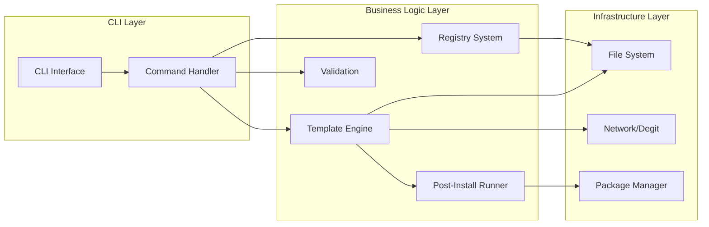

### 3. Data Flow Architecture

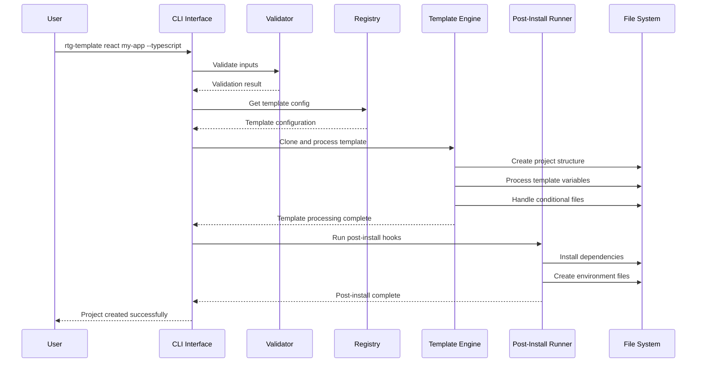

### 4. Template Processing Pipeline

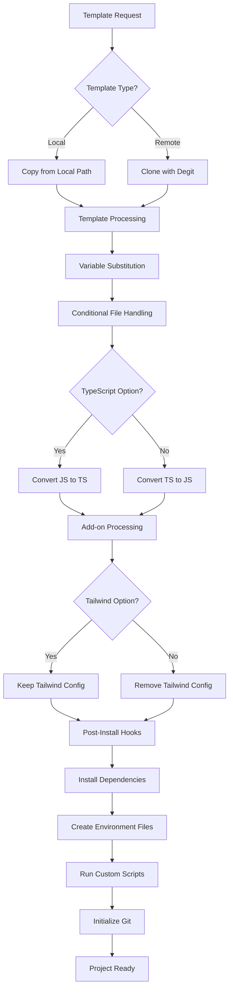

### 5. Plugin Architecture (Future Extension)

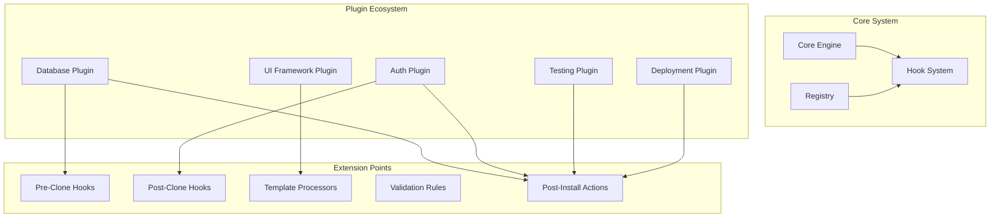

### 6. Scalability Considerations

- **Template Registry**: Designed to support external registries and template marketplaces
- **Caching Strategy**: Template metadata caching to reduce network requests
- **Parallel Processing**: Concurrent file operations during template processing
- **Memory Management**: Streaming for large template files
- **Error Handling**: Graceful degradation with detailed error reporting

---

## Software Developer Perspective

### 1. Technology Stack

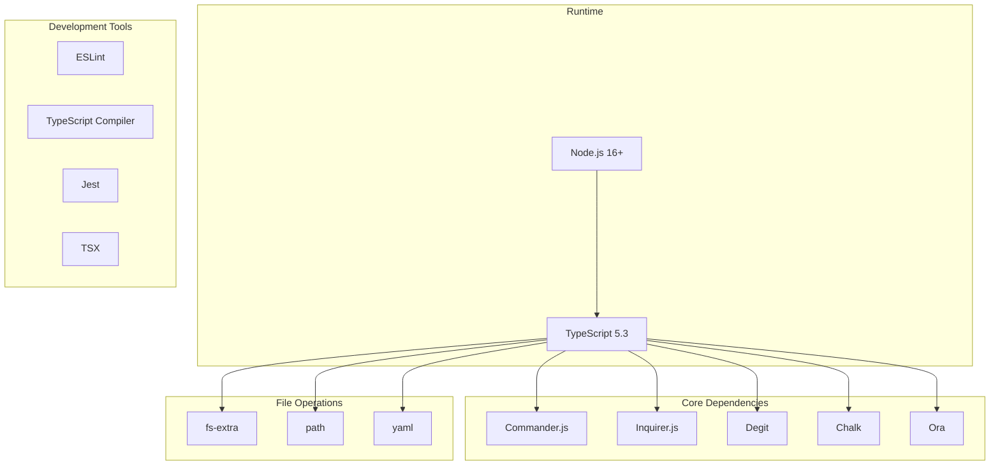

### 2. Code Structure Analysis

```
src/
├── cli.ts                    # Entry point (68 lines)
├── types.ts                  # Type definitions (54 lines)
├── index.ts                  # Main exports (11 lines)
├── commands/                 # Command implementations
│   ├── create.ts            # Project creation (97 lines)
│   ├── interactive.ts       # Interactive mode (124 lines)
│   └── list.ts              # Template listing (34 lines)
├── core/                    # Core business logic
│   ├── registry.ts          # Template registry (178 lines)
│   ├── template-engine.ts   # Template processing (441 lines)
│   └── post-install.ts      # Post-install hooks (186 lines)
└── utils/                   # Utility functions
    └── validation.ts        # Input validation (129 lines)
```

### 3. Key Classes and Interfaces

#### Type System

```typescript
interface TemplateConfig {
  name: string;
  description: string;
  repository?: string;
  directory?: string;
  frameworks: string[];
  addons: string[];
  postInstall?: PostInstallConfig;
}

interface CreateProjectOptions {
  typescript?: boolean;
  tailwind?: boolean;
  reduxToolkit?: boolean;
  auth?: boolean;
  prisma?: boolean;
  mongodb?: boolean;
  mysql?: boolean;
  postgres?: boolean;
  interactive?: boolean;
  directory?: string;
  repo?: string;
  install?: boolean;
  git?: boolean;
}
```

#### Core Engine

```typescript
class TemplateEngine {
  constructor(private config: TemplateConfig) {}

  async cloneTemplate(context: TemplateContext): Promise<void>
  async processTemplate(context: TemplateContext): Promise<void>
  private async updatePackageJson(...)
  private async processTemplateFiles(...)
  private async handleConditionalFiles(...)
}
```

### 4. Template Variable System

The system supports three types of template variables:

1. **Uppercase**: `{{PROJECT_NAME}}` → `MY_PROJECT`
2. **Lowercase**: `{{project-name}}` → `my-project`
3. **Title Case**: `{{Project Name}}` → `My Project`

### 5. File Processing Logic

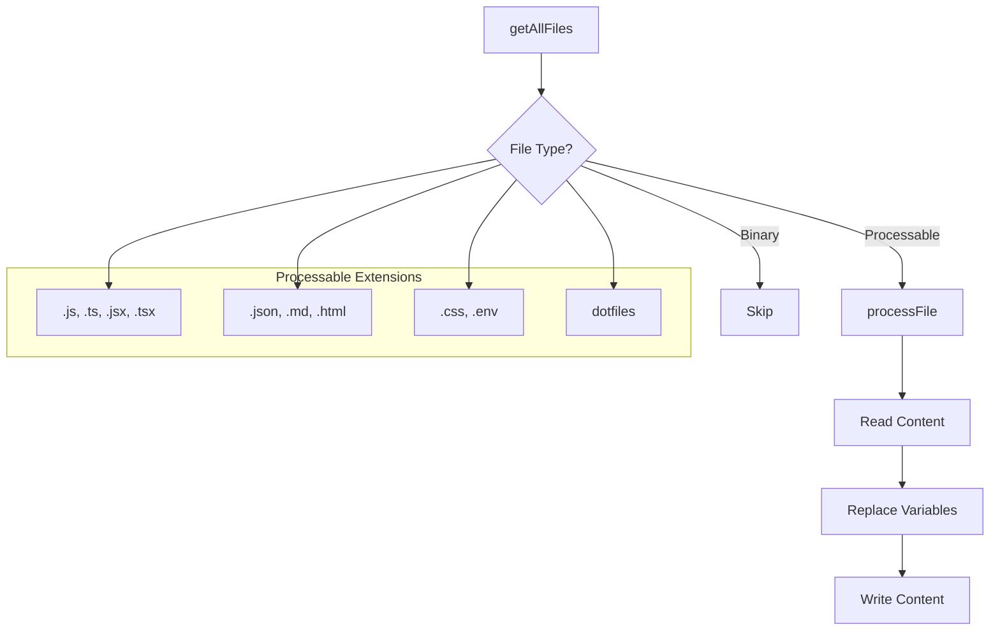

### 6. Development Workflow

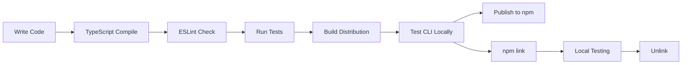

### 7. Testing Strategy

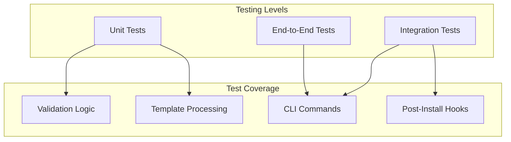

---

## Product Manager Perspective

### 1. Market Position

RTG Templates positions itself as a developer productivity tool in the competitive landscape of project scaffolding solutions:

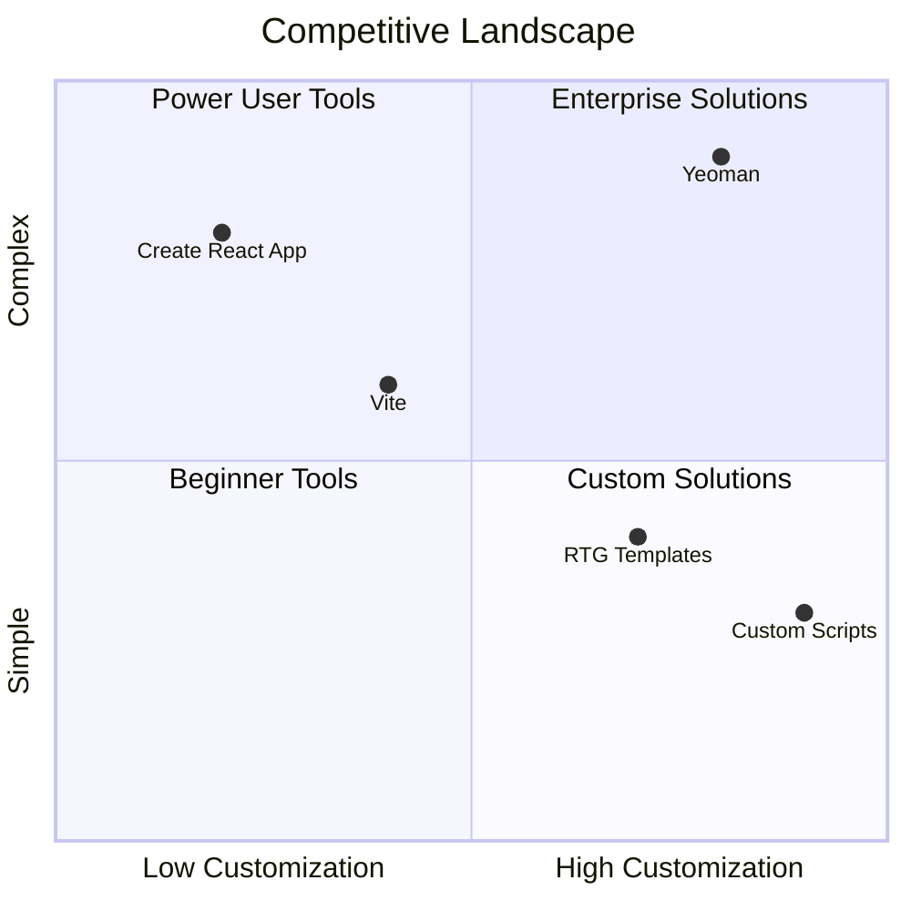

### 2. Feature Matrix

| Feature             | RTG Templates | Create React App | Vite    | Yeoman |
| ------------------- | ------------- | ---------------- | ------- | ------ |
| Interactive Mode    | ✅            | ❌               | ✅      | ✅     |
| Multiple Frameworks | ✅            | ❌               | ✅      | ✅     |
| TypeScript Support  | ✅            | ✅               | ✅      | ✅     |
| Custom Templates    | ✅            | ❌               | ❌      | ✅     |
| Post-Install Hooks  | ✅            | ❌               | ❌      | ✅     |
| Add-on System       | ✅            | ❌               | Limited | ✅     |
| Template Registry   | ✅            | ❌               | ❌      | ✅     |

### 3. User Journey Mapping

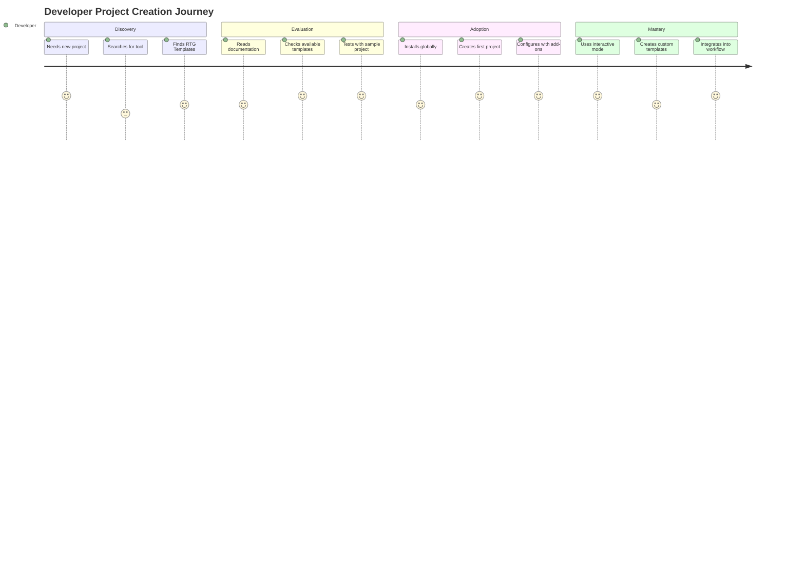

### 4. Value Proposition Canvas

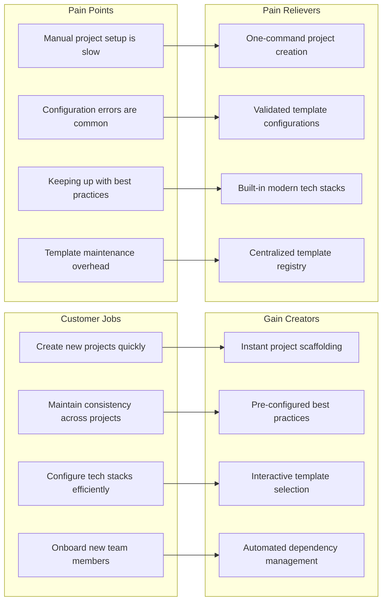

### 5. Success Metrics & KPIs

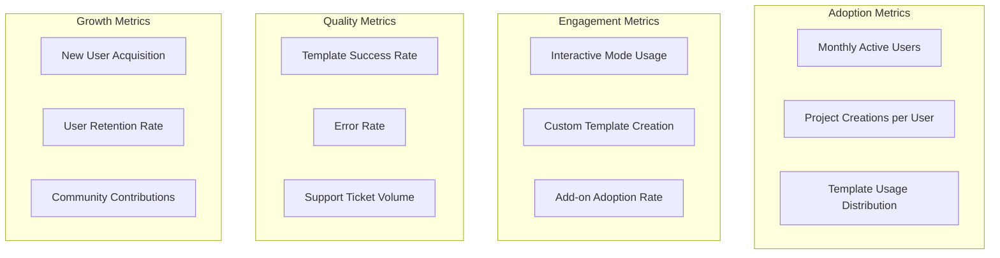

### 6. Roadmap Priorities

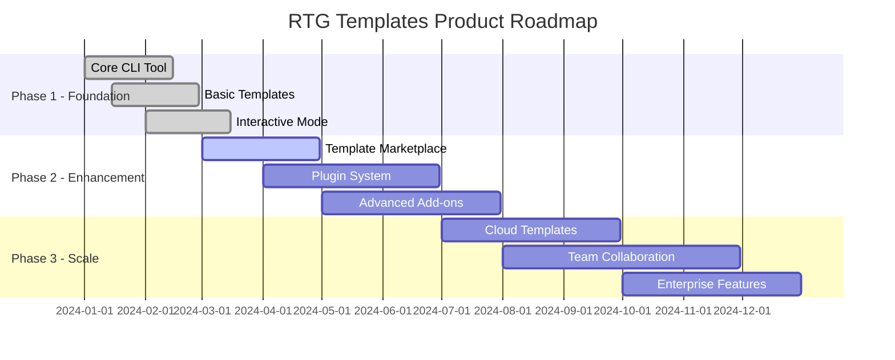

---

## How to Add a New Template

### Step-by-Step Guide

#### 1. Choose Template Type

**Option A: Local Template (Recommended for built-in templates)**

- Create template files in `templates/` directory
- Good for: Core templates, frequently used stacks

**Option B: External Repository Template**

- Host template in separate Git repository
- Good for: Community templates, specialized use cases

#### 2. Create Template Structure

For a local template, create the directory structure:

```
templates/your-new-template/
├── package.json                 # With template variables
├── README.md                   # Project documentation
├── .gitignore                  # Git ignore rules
├── .env.example               # Environment template
├── src/                       # Source code directory
│   ├── index.js               # Main entry point
│   └── components/            # Framework-specific structure
├── public/                    # Public assets (if applicable)
├── config/                    # Configuration files
│   ├── eslint.config.js
│   ├── prettier.config.js
│   └── tailwind.config.js     # If using Tailwind
└── .get-template.js           # Custom post-install (optional)
```

#### 3. Use Template Variables

In your template files, use these variables:

```javascript
// package.json
{
  "name": "{{project-name}}",
  "description": "{{Project Name}} - A modern web application"
}

// README.md
# {{Project Name}}

Welcome to {{Project Name}}! This project was created using RTG Templates.

// src/index.js
console.log('Starting {{PROJECT_NAME}}...');
```

#### 4. Register the Template

Add your template to `src/core/registry.ts`:

```typescript
'your-template-name': {
  name: 'your-template-name',
  description: 'Brief description of your template',
  repository: 'local:templates/your-new-template', // For local templates
  // repository: 'github-user/repo-name',         // For external templates
  frameworks: ['Framework1', 'Framework2'],
  addons: ['typescript', 'tailwind', 'auth'],    // Supported add-ons
  postInstall: {
    dependencies: ['express', 'react'],
    devDependencies: ['typescript', '@types/node'],
    envTemplate: 'PORT=3000\nNODE_ENV=development\n',
    instructions: 'Run `npm run dev` to start development server.',
  },
},
```

#### 5. Handle Add-ons (Optional)

Modify `src/core/template-engine.ts` to handle your specific add-ons:

```typescript
// In handleConditionalFiles method
if (options.yourCustomAddon) {
  await this.setupYourCustomAddon(targetPath, shouldUseTypeScript);
}

// Add your custom setup method
private async setupYourCustomAddon(targetPath: string, isTypeScript: boolean): Promise<void> {
  // Custom setup logic
  const configFile = isTypeScript ? 'config.ts' : 'config.js';
  const configContent = `
    // Your custom configuration
    export default {
      // Configuration options
    };
  `;

  await fs.writeFile(path.join(targetPath, 'config', configFile), configContent);
}
```

#### 6. Add Custom Post-Install Script (Optional)

Create `.get-template.js` in your template root:

```javascript
module.exports = {
  async postInstall(targetPath) {
    const fs = require("fs-extra");
    const path = require("path");

    // Custom setup logic
    console.log("Running custom setup for your template...");

    // Example: Create additional directories
    await fs.ensureDir(path.join(targetPath, "custom-directory"));

    // Example: Generate configuration files
    const configContent = {
      version: "1.0.0",
      features: ["feature1", "feature2"],
    };

    await fs.writeJson(path.join(targetPath, "template.config.json"), configContent, { spaces: 2 });
  },
};
```

#### 7. Test Your Template

```bash
# Build the project
npm run build

# Test locally with npm link
npm link

# Test your new template
rtg-template your-template-name test-project

# Test with add-ons
rtg-template your-template-name test-project --typescript --tailwind

# Test interactive mode
rtg-template --interactive
```

#### 8. Advanced Template Features

**Conditional Files Based on Options:**

```javascript
// In your template files, use conditional logic
{{#if typescript}}
import { Express } from 'express';
{{else}}
const express = require('express');
{{/if}}
```

**Dynamic Package.json Dependencies:**

```javascript
// The template engine will automatically add dependencies based on options
// TypeScript option adds: typescript, @types/node
// Tailwind option adds: tailwindcss, postcss, autoprefixer
// You can also specify custom dependencies in the registry
```

**Environment Configuration:**

```bash
# .env.example
DATABASE_URL={{#if mongodb}}mongodb://localhost:27017/{{project-name}}{{/if}}{{#if postgres}}postgresql://localhost:5432/{{project-name}}{{/if}}
JWT_SECRET=your-jwt-secret-here
NODE_ENV=development
```

### Template Best Practices

#### 1. File Organization

- Keep consistent directory structure across templates
- Use meaningful file and directory names
- Include necessary configuration files (ESLint, Prettier, etc.)

#### 2. Documentation

- Always include a comprehensive README.md
- Document available scripts and commands
- Provide setup instructions and prerequisites

#### 3. Dependencies

- Use specific version ranges for stability
- Include both runtime and development dependencies
- Consider bundle size and security of dependencies

#### 4. Configuration

- Provide sensible defaults
- Make configuration files easy to understand and modify
- Use environment variables for sensitive data

#### 5. Testing

- Include basic test setup
- Provide example tests
- Configure test scripts in package.json

### Example: Creating a Vue.js Template

Let's walk through creating a complete Vue.js template:

#### 1. Create Template Directory

```bash
mkdir templates/vue-typescript
cd templates/vue-typescript
```

#### 2. Create package.json

```json
{
  "name": "{{project-name}}",
  "version": "0.0.0",
  "description": "{{Project Name}} - A Vue.js application with TypeScript",
  "scripts": {
    "dev": "vite",
    "build": "vue-tsc --noEmit && vite build",
    "preview": "vite preview",
    "lint": "eslint . --ext .vue,.js,.jsx,.cjs,.mjs,.ts,.tsx,.cts,.mts --fix --ignore-path .gitignore"
  },
  "dependencies": {
    "vue": "^3.3.0"
  },
  "devDependencies": {
    "@vitejs/plugin-vue": "^4.0.0",
    "@vue/eslint-config-typescript": "^12.0.0",
    "@vue/tsconfig": "^0.5.0",
    "eslint": "^8.0.0",
    "eslint-plugin-vue": "^9.0.0",
    "typescript": "~5.0.0",
    "vite": "^5.0.0",
    "vue-tsc": "^1.0.0"
  }
}
```

#### 3. Create Basic Vue App Structure

```vue
<!-- src/App.vue -->
<template>
  <div id="app" class="min-h-screen bg-gray-100">
    <header class="bg-white shadow">
      <div class="max-w-7xl mx-auto py-6 px-4">
        <h1 class="text-3xl font-bold text-gray-900">Welcome to {{Project Name}}</h1>
      </div>
    </header>

    <main class="max-w-7xl mx-auto py-6 px-4">
      <Counter :initial-value="0" />
    </main>
  </div>
</template>

<script setup lang="ts">
import Counter from "./components/Counter.vue";
</script>
```

```vue
<!-- src/components/Counter.vue -->
<template>
  <div class="bg-white rounded-lg shadow p-6">
    <h2 class="text-xl font-semibold mb-4">Counter Example</h2>
    <div class="flex items-center space-x-4">
      <button @click="decrement" class="btn btn-red">-</button>
      <span class="text-2xl font-bold">{{ count }}</span>
      <button @click="increment" class="btn btn-green">+</button>
    </div>
  </div>
</template>

<script setup lang="ts">
import { ref } from "vue";

interface Props {
  initialValue?: number;
}

const props = withDefaults(defineProps<Props>(), {
  initialValue: 0,
});

const count = ref(props.initialValue);

const increment = () => count.value++;
const decrement = () => count.value--;
</script>

<style scoped>
.btn {
  @apply px-4 py-2 rounded text-white font-medium transition-colors;
}
.btn-red {
  @apply bg-red-500 hover:bg-red-600;
}
.btn-green {
  @apply bg-green-500 hover:bg-green-600;
}
</style>
```

#### 4. Register in Registry

```typescript
// In src/core/registry.ts
'vue-typescript': {
  name: 'vue-typescript',
  description: 'Vue.js application with TypeScript and Vite',
  repository: 'local:templates/vue-typescript',
  frameworks: ['Vue.js', 'TypeScript', 'Vite'],
  addons: ['tailwind'],
  postInstall: {
    dependencies: ['vue'],
    devDependencies: ['@vitejs/plugin-vue', 'typescript', 'vue-tsc'],
    instructions: 'Run `npm run dev` to start the development server.',
  },
},
```

#### 5. Test the Template

```bash
npm run build
rtg-template vue-typescript my-vue-app --tailwind
cd my-vue-app
npm run dev
```

---

## Technical Architecture

### 1. System Context Diagram

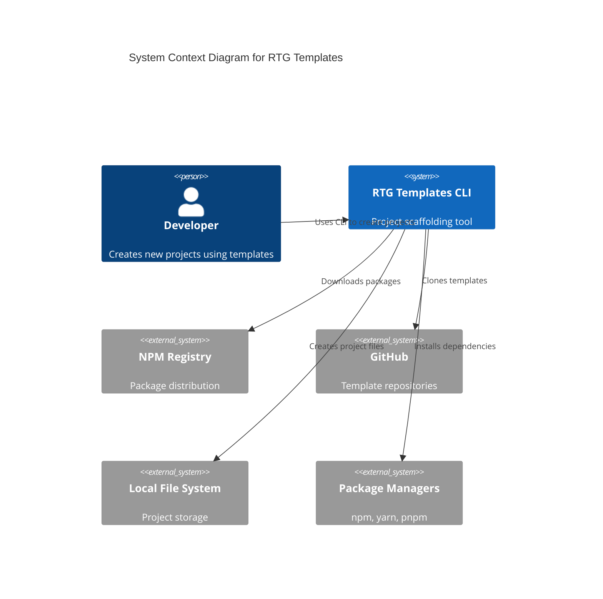

### 2. Container Diagram

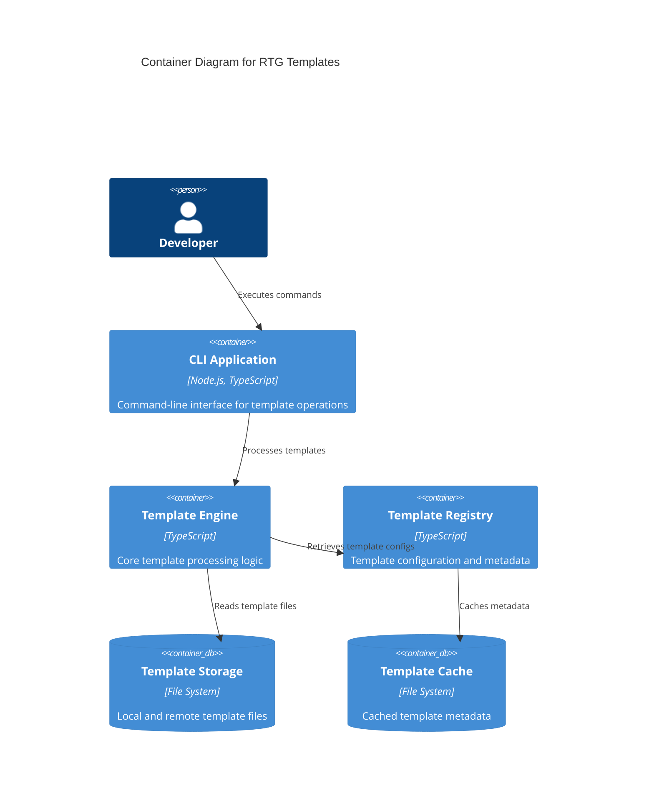

### 3. Component Diagram

```mermaid
C4Component
    title Component Diagram for RTG Templates CLI

    Container(cli, "CLI Application") {
        Component(commander, "Command Parser", "Commander.js", "Parses CLI arguments and routes commands")
        Component(interactive, "Interactive Mode", "Inquirer.js", "Provides interactive template selection")
        Component(validator, "Input Validator", "TypeScript", "Validates user inputs and options")
    }

    Container(engine, "Template Engine") {
        Component(cloner, "Template Cloner", "Degit", "Clones templates from repositories")
        Component(processor, "Template Processor", "TypeScript", "Processes template files and variables")
        Component(converter, "File Converter", "TypeScript", "Converts between JS/TS and handles add-ons")
    }

    Container(postinstall, "Post-Install System") {
        Component(depmanager, "Dependency Manager", "TypeScript", "Installs npm dependencies")
        Component(envsetup, "Environment Setup", "TypeScript", "Creates environment files")
        Component(gitinit, "Git Initializer", "TypeScript", "Initializes git repository")
    }

    Rel(commander, validator, "Validates inputs")
    Rel(commander, interactive, "Delegates to interactive mode")
    Rel(interactive, validator, "Validates selections")
    Rel(validator, cloner, "Triggers template cloning")
    Rel(cloner, processor, "Provides cloned template")
    Rel(processor, converter, "Applies transformations")
    Rel(converter, depmanager, "Triggers post-install")
    Rel(depmanager, envsetup, "Sets up environment")
    Rel(envsetup, gitinit, "Initializes git")
```

### 4. Deployment Architecture

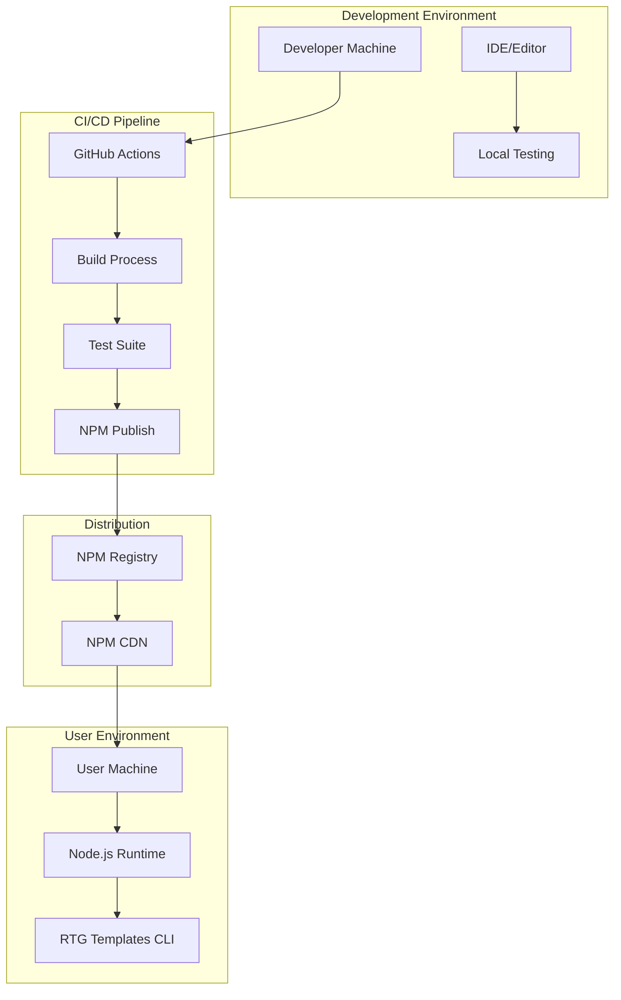

---

## Security Considerations

### 1. Security Threat Model

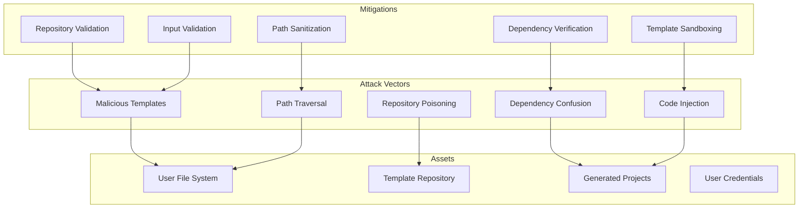

### 2. Security Implementation

1. **Input Validation**

   - Strict project name validation
   - Repository URL validation
   - Path traversal prevention

2. **Template Security**

   - Repository authentication
   - Template signing (future)
   - Malware scanning (future)

3. **File System Security**

   - Sandboxed template processing
   - Safe file operations
   - Permission validation

4. **Dependency Security**
   - Dependency vulnerability scanning
   - Package integrity verification
   - Supply chain security

---

## Performance Analysis

### 1. Performance Metrics

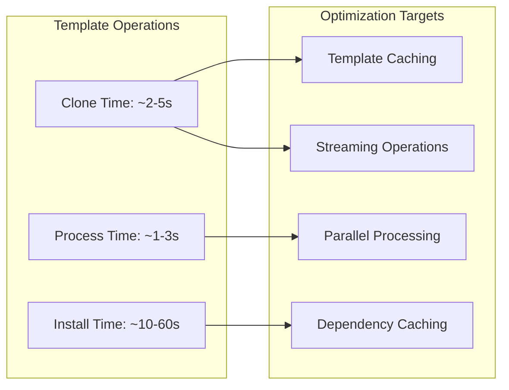

### 2. Bottleneck Analysis

1. **Network Operations**

   - Template cloning from remote repositories
   - NPM package downloads
   - Registry metadata fetching

2. **File System Operations**

   - Large template file copying
   - Template variable replacement
   - Directory creation and permissions

3. **Package Installation**
   - NPM dependency resolution
   - Package compilation (native modules)
   - Post-install scripts execution

---

## Future Roadmap

### 1. Planned Features

```mermaid
timeline
    title RTG Templates Roadmap

    2024 Q2 : Template Marketplace
            : Plugin System
            : Advanced Templates

    2024 Q3 : Cloud Templates
            : Team Collaboration
            : Template Analytics

    2024 Q4 : Enterprise Features
            : Template Versioning
            : Advanced Security

    2025 Q1 : AI-Powered Templates
            : Template Recommendations
            : Automated Updates
```

### 2. Technical Evolution

1. **Phase 1: Core Enhancement**

   - Template marketplace integration
   - Plugin architecture implementation
   - Performance optimizations

2. **Phase 2: Cloud Integration**

   - Cloud-hosted templates
   - Real-time collaboration
   - Template analytics dashboard

3. **Phase 3: AI Integration**

   - AI-powered template generation
   - Smart template recommendations
   - Automated best practice updates

4. **Phase 4: Enterprise**
   - Enterprise security features
   - Compliance and governance
   - Advanced team management

---

## Conclusion

RTG Templates represents a mature, well-architected solution for project scaffolding with significant potential for growth and enhancement. The modular design, comprehensive type system, and extensible architecture provide a solid foundation for future development while serving current developer productivity needs effectively.

The combination of interactive user experience, powerful template processing capabilities, and extensive customization options positions RTG Templates as a competitive solution in the developer tooling market.
